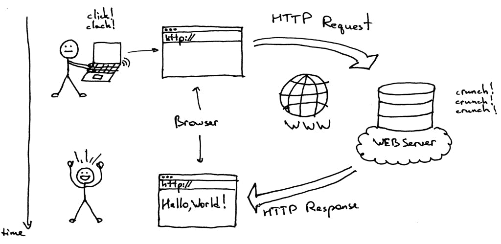

# Aula 1

Introdução a backend development

## Node.js

Runtime que permite executar JavaScript fora do browser.

Docs: https://nodejs.org/docs/latest-v20.x/api/index.html

Versões do Node.js que devem utilizar são as pares, por serem as mais estáveis e com maior período de suporte (https://nodejs.org/en/learn/getting-started/introduction-to-nodejs).

Para gerirem várias versões do Node.js na vossa máquina, sugere-se que usem o NVM: https://github.com/nvm-sh/nvm.

## Server-side computing

É no lado dos servidores que é armazenada a generalidade dos dados das aplicações, assim como é onde são feitas as computações mais complexas e pesadas.
São as aplicações que executam nos servidores que são habitualmente responsáveis por manter um estado consistente, persistente e seguro, tendo estas quase sempre um papel autoritário.

https://developer.mozilla.org/en-US/docs/Learn/Server-side/First_steps/Introduction

### HTTP

As aplicações client-side (websites, apps mobile, etc.) precisam então de comunicar com servidores de modo a obter e alterar dados/conteúdo. Pensando no caso do blog, o frontend do blog tem que obter uma lista de posts, talvez uma lista de posts de um user específico, atualizar um post, deixar um comentário, etc.

Apesar de existirem vários protocolos diferentes de comunicação, o mais comum na web é o [HTTP](https://developer.mozilla.org/en-US/docs/Glossary/HTTP).

Através do HTTP, as aplicações client-side enviam mensagens para um servidor, que por sua vez é responsável por retornar uma resposta. Estas mensagens servem para pedir dados (JSON, imagens, HTML, etc.) e para desencadear ações no servidor (enviar um email, gerar uma imagem, gravar um texto, etc.).

https://developer.mozilla.org/en-US/docs/Web/HTTP/Overview

### Request - Response

As mensagens enviadas do cliente (browser, app) para o servidor são os "requests", send que o servidor é responsável por retornar uma resposta.

https://developer.mozilla.org/en-US/docs/Web/HTTP/Messages
https://www.ibm.com/docs/en/cics-ts/5.3?topic=protocol-http-requests

#### Request

- [método](https://developer.mozilla.org/en-US/docs/Web/HTTP/Methods): indica o tipo de ação (GET, POST, DELETE, etc)
- endereço e caminho/path
  - exemplo: https://mydomain.com/api/pets -> endereço: https://mydomain.com; path: /api/pets
- [headers](https://developer.mozilla.org/en-US/docs/Web/HTTP/Headers): metadados sobre o request (origem, tipo de dispositivo, etc)
- body: conteúdo opcional a eniar para o servidor (p.ex. um JSON que descreve o blog post que quero criar)

#### Response

- [status code](https://developer.mozilla.org/en-US/docs/Web/HTTP/Status): código que indica o resultado da ação
- headers (como no request mas descrevem a resposta)
- body: conteúdo retornado pelo servidor (p.ex. a lista de posts filtradas pela tag "pets", dos users rating > 7)

## Servidor HTTP

Vamos então criar, com Node.js, uma aplicação capaz de agir como servidor HTTP.
Esta aplicação, quando iniciada, vai ficar indeterminadamente à escuta de requests HTTP para depois agir conforme o que progamarmos (retornando sempre uma resposta).

Seja no Node.js ou noutro ambiente de programação, os detalhes de como funciona o procolo HTTP são abstraídos, de forma a não termos que nos preocupar com eles. Comparativamente, no browser essa abstração é feita pela API [fetch](https://developer.mozilla.org/en-US/docs/Web/API/Fetch_API): usamos a função `fetch()` para enviar um request HTTP, mas o que internamente é feito ao nível mais baixo é algo que não temos que saber.

### Estrutura

A estrutura elementar de uma aplicação do género tem duas partes:

- definir o comportamento do servidor (o que fazer quando recebe um request)
- iniciar o servidor HTTP (com algumas configurações)

Na diretoria `./v1` temos uma implementação simples, com recurso apenas às ferramentas que o Node.js disponibiliza.

Tal como usamos o React.js para facilitar a criação de aplicações web dinâmicas, no backend também existem várias libraries e frameworks que facilitam o nosso trabalho enquanto programadores.

Neste módulo vamos usar o [Express](https://expressjs.com/) que é de longe o mais utilizado. Existem uma série de alternativas que funcionam de maneira semelhante, sendo que cada framework tem as suas particularidades e features. Exemplos: [Fastify](https://fastify.dev/), [NestJS](https://nestjs.com/), [Hapi](https://hapi.dev/), [koa](https://koajs.com/).

Na diretoria `./v2` temos o equivalente a `./v1` mas implementado com a ajuda do Express.

## Ferramentas

[Postman](https://www.postman.com/) - para testar requests HTTP

https://learning.postman.com/docs/getting-started/first-steps/sending-the-first-request/
