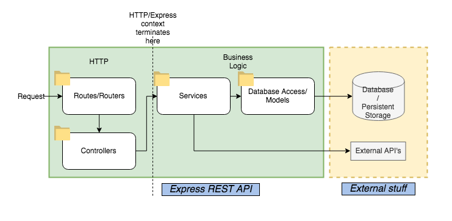

# Middleware

No contexto de um servidor web, middleware é uma função que é executada (quase sempre) antes do handler/route. Estas funções têm, tal como o handler, acesso aos objetos Request e Response, o que significa que podem agir sobre o request, alterar conteúdo, terminar o request e enviar uma resposta.
É utilizado para operações que queremos comuns a um conjunto de rotas:

- fazer log de requests que chegam ao servidor,
- garantir que o user que fez o request está autenticado
- fazer algum tipo de validação

Para além de acesso aos objectos Request e Response, num middleware usamos outro argumento da função: o Next.
Next é uma função do Express que, quando invocada, desencadeia a execução do próximo middleware.

```
const express = require('express')
const app = express()

// middleware
app.use(express.json())

// middleware
app.use((req, res, next) => {
  console.log('Time:', Date.now())
  next()
})

// handler/route
app.get('/user/:id', (req, res, next) => {
  res.send('USER')
})
```

No fundo, no Express compomos uma cadeia de middlewares/funções, que vão ser executadas uma de cada vez, durante o cicle de vida de um request.


No Express: https://expressjs.com/en/guide/using-middleware.html

### Javascript Higher-Order Functions

https://www.syncfusion.com/blogs/post/javascript-higher-order-functions-a-complete-guide.aspx

# Validação de Input

Tudo o que a nossa API aceita como imput deve ser sempre validado porque tudo é manipulável. Os requests que nos chegam tanto podem ter origem na aplicação React que controlamos, bem como de hackers e bots espalhados pelo mundo.

As validações que temos a fazer incidem sobre headers, body, query string, e path.

Podemos fazer esse trabalho com recurso a construções da linguagem (if, switch...), ou podemos recorrer a libraries que nos facilitam a vida.

Optámos pelo [Joi](https://joi.dev/), que nos dá ferramentas para: criar um schema, validar um objeto contra esse schema.

# Estrutura e Organização

Tal como em qualquer outro projeto, à medida que o código cresce, aumenta também a sua complexidade, o que nos obriga a seguir algumas práticas de estrutura do projeto e código.

Seja qual for a abordagem, a ideia é criar [separação de conceitos](https://en.wikipedia.org/wiki/Separation_of_concerns) e desacopolação de módulos (loosely coupled, para ser mais correto). Queremos então camadas que são de responsabilidade contida, e que são facilmente ligadas e desligadas umas das outras. Isto é o que nos permite adicionar funcionalidade sem ter que mudar centenas de linhas de código, mesmo estando num projeto de grande dimensão. Para elém disso, torna-se mais fácil implementar testes automáticos, bem como a leitura/manutenção do código se torna mais simpática.



Duas abordagens comuns para um servidor web desenvolvido com Express (ou semelhante), são: organização por camadas, ou por featuer/domínio.

### Por Camadas

Para cada camada da aplicação é criada uma subdiretoria.
Cada camada agrupa módulos que têm responsabilidades semelhantes, embora possam dizer respeito a domínios diferentes.

O mais comum é uma divisão em:

- handlers/controllers/routes: todas as rotas Express, com a sua lógica de validação do request e envio de resposta
- services: camada de lógica
- data/repositories: camada de acesso a dados

### Por Features

Para cada feature/recurso/domínio é criada uma subdiretoria.
Cada camada agrupa todo o código de handling de requests, lógica e acesso a dados, restrito a um determinado domínio (p.ex., posts, users)
