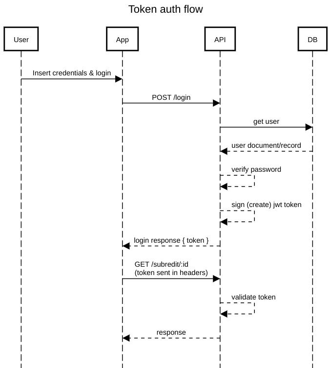

# Autenticação

A autenticação é um aspeto crucial do desenvolvimento web que envolve a verificação da identidade dos utilizadores que acedem a uma aplicação web ou, falando concretamente do que temos desenvolvido, uma API REST. Garante que apenas indivíduos autorizados podem aceder a determinados recursos ou realizar ações específicas num site.

Dentro dos métodos de autenticação existentes, o mais comum é mesmo a típica combinação username+password. Neste, o utilizador tem que se autenticar com as suas credenciais antes de poder aceder a áreas ou ações reservadas. Porque uma API REST é o que muitas vezes serve os dados e ações de apps, também estas possuem partes protegidas por autenticação (neste caso, as rotas/endpoints).

Independentemente do método de autenticação, o conceito essencial é: a autenticação do user requer a validação das suas credenciais e, se válidas, este terá na sua posse um comprovativo temporário de que é quem diz ser. A analogia referida na aula foi a do check-in num hotel, em que após verificação da identidade/reserva, temos direito a um cartão que nos dá acesso a recursos (quarto, salas de conferências, restaurante, etc).

Analisaremos dois tipos diferentes de autenticação habituais no contexto de aplicações web: com base em sessões e com base em tokens.

## Sessões

Na autenticação baseada em sessões, quando um utilizador faz login com sucesso, o servidor cria uma sessão única para esse utilizador. Uma identificação de sessão é gerada e armazenada no servidor, enquanto um cookie contendo essa identificação é enviado para o cliente.

As informações de autenticação são então armazenadas no servidor, agregadas ao iedentificador da sessão, o que significa que o servidor mantém o estado da sessão do utilizador.

## Tokens JWT

Na autenticação baseada em tokens JWT, quando um utilizador faz login com sucesso, um token JWT é gerado e enviado de volta para o cliente. Esse token contém informações sobre o utilizador e é criptográficamente assinado para garantir a sua integridade.

As informações de autenticação são armazenadas no próprio token JWT, que é enviado para o cliente (frontend) e geralmente armazenado em cookies ou localStorage (menos seguro). Isso significa que o servidor não precisa armazenar o estado da sessão do utilizador (stateless)

## Comparação:

- Desempenho: A autenticação baseada em tokens JWT pode ser mais eficiente em termos de desempenho, uma vez que não requer armazenamento de estado no servidor (requer menos acessos à base de dados)
- Escalabilidade: Os tokens JWT são mais escaláveis em ambientes distribuídos, facilitando a escalabilidade horizontal
- Segurança: Ambas as abordagens são seguras quando implementadas corretamente

# Passwords

As passwords em plain-text (como as escrevemos) NUNCA são guardadas nas bases de dados.
Para guardar uma password, é necessário transformá-la num texto ilegivel mas que pode ser comprado com o texto original. Isto é possível através de uma função hash. No Node.js, podemos usar o package [bcrypt](https://www.npmjs.com/package/bcrypt) que nos dá as funcionalidades que necessitamos: a função "hash" para criar uma hash a partir de um texto, e uma função "compare" para comparar um texto normal com uma hash e verificar se são equivalentes.

# Tokens JWT

Os tokens JWT são um standard que define um formato de transferência de dados de forma segura, usando JSON. Estes tokens podem ser assinados criptográficamente e verificados para garantir que tanto a sua origiem (assinatura) como o seu conteúdo são de confiança.

De forma muito simplificada, o nosso backend guarda um segredo (no fundo, uma password), que usa para criar tokens JWT. Como apenas o nosso sistema conhece esta password, conseguimos posteriorment verificar se um determinado token é válido, ou seja, se foi assinado/gerado pelo nosso backend. A verificação da assinatura garante também que o conteúdo do token não foi manipulado.

Estes tokens são muito utilizados para fins de autenticação, como explicado acima. Depois da aplicação web/mobile enviar um request com as credenciais do user (após este efetuar login), em troca pode receber um token JWT. Posteriormente estes tokens são enviados nos requests à API que o emitiu.

Habitualmente de curta validade, funcionam como um certificado que garante que quem os possuí, se autenticou com sucesso. Uma boa analogia é o cartão de cidadão. Embora a sua validade seja maior, o conceito base é muito semelhante: é emitido para uma única entidade e serve como prova de identificação, existem mecanismos que garantem a sua autenticidade, quando expira podemos obter um novo.

No Node.js, podemos recorrer ao package [jsonwebtoken](https://www.npmjs.com/package/jsonwebtoken), que tem as duas funções que precisamos para trabalhar com tokens: `sign` para os criarmos, `verify` para os validarmos e extraír o payload.

https://jwt.io/introduction
